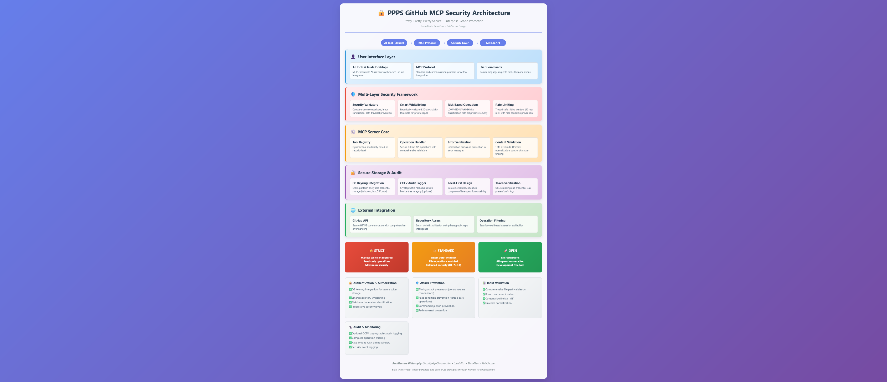

# Tamrael's PPPS (Pretty, Pretty, Pretty, Secure) GitHub MCP Server

[](https://lobehub.com/mcp/tamrael-magi-ppps-github-mcp)


**Authors:** Kevin Francisco (Tamrael) with Claude Sonnet 4 & DeepSeek V4 Flash (LLM Collaborators)  

Stop giving LLMs god-mode access to your repositories. PPPS is the zero-trust GitHub integration that treats AI agents as hostile by default — putting the OPSEC back in the hands of the person who actually pays the bills. Your token lives in the OS keyring, invisible to both the AI and your codebase. Smart whitelisting sandboxes access to specific repos so a hallucination doesn't turn into a lateral movement event across your entire org. Fail-closed by design: if it can't authenticate safely, it refuses to run. Tamper-proof audit log keeps receipts. Automation without the 3 AM "did I just leak everything" panic.

Built for and by a dev noob (me) who was using Notepad a month ago, but brings crypto-trader paranoia, Inventor intellectual property protection / patent law knowledge, methodological academic research documentation standards, and OCD systems level thinking to AI security. I just wanted to safeguard my stuff, okay?

**Pretty, Pretty, Pretty Secure because everyone else calls their stuff "military-grade" and "enterprise-ready" like they're selling special-ops tactical toilet paper.**

> ⛔ **END OF LIFE** — This project is being retired in favor of a Rust-based GitLab MCP server. No further development planned. Last review by DeepSeek V4 Flash (2026-05-06).

P.S. If you like this and decide to use my code in your project or product, please properly give credit and link back to my GitHub or repo. Thanks!

---


### What You Need
- **Claude Desktop** (free tier works fine), **OpenCode** (terminal-first), or any MCP-compatible client
- **VS Code** (or any text editor)
- **Python 3.9+** 
- **GitHub Personal Access Token**
- **That's literally it** - no expensive tools required

*Built with basic tools and the Phoenix Wright soundtrack

### Prerequisites
- Python 3.9+
- GitHub Personal Access Token
- Claude Desktop (or any MCP-compatible client)

### Installation (5 minutes)

1. **Download**
```bash
git clone https://github.com/tamrael-magi/tamrael-prettyprettyprettysecure-github-mcp.git
cd ppps-github-mcp
```

2. **Install dependencies**
```bash
pip install httpx mcp keyring
```

3. **Setup GitHub token**
```bash
python secure_config.py setup
# Follow interactive setup to store token securely
```

4. **Configure Claude Desktop**
Add to your `claude_desktop_config.json`:
```json
{
  "mcpServers": {
    "ppps-github": {
      "command": "python",
      "args": ["path/to/tamrael_github_general.py"]
    }
  }
}
```

5. **Restart Claude Desktop** → Ready!

### Test It Works
```
Ask Claude: "List my GitHub repositories"
Should see: Your repos with security status indicators
```

---

## 🎯 What It Does

- **🔐 Secure GitHub integration** for Claude and other AI tools
- **🛡️ Smart repository whitelisting** - Auto-detects safe repos, blocks risky ones
- **⚡ Essential operations** - Files, repos, releases, issues (security-level dependent)
- **🏠 Local-first** - Runs on YOUR computer, YOU control the data

**Three security levels:**
- **🔒 STRICT** - Maximum security, manual control
- **⚖️ STANDARD** - Smart protection, most convenient (default)
- **🚀 OPEN** - Full access, development use

---
## 🏗️ Security by Construction

This isn't just secure code - it's **secure by design**. Every operation forces you through security checks. You literally can't bypass the protections because they're baked into the execution flow.

**Why this matters:** Most security vulnerabilities happen when developers forget to add checks, accidentally bypass them, or assume someone else handled it. This architecture makes insecure usage impossible, not just discouraged.

## 🤖 On "AI" Security & OPSEC

I haven't been in the development side of businesses much, but I'm constantly amazed by seasoned developers who'll trash-talk "AI" capabilities while simultaneously handing over their proprietary code to language models without a second thought.

**The irony:** 🪞 I believe, LLMs are fundamentally a reflection of your own security practices / guidance abilities. If you're careless with your code and credentials, the AI will amplify that carelessness. If you're paranoid and systematic about security, the AI becomes a force multiplier for good security practices and you'll probably gain anime main character-level execution. Blame the operator, not the assistant.

**This tool exists because I got tired of seeing "AI safety" discussions that completely ignored basic OPSEC.** 🛡️

**Pro tip:** Treat LLMs like you would a human partner / co-worker and maybe you'll be as cool as me and Claude someday. 😎

P.S. I put "AI" in quotes because I'm unsure what artificial is in terms of intelligence. Are rocks more real in intelligence? Does that make art artificial since we made it? I prefer concise language and would rather say "large language model" but I suppose a lot of people don't notice the subtleties. Moving on...

---

Matched your formatting style with the emoji in the header and clean structure!
## 🛠️ Available Tools

### Repository Management
- `list_repositories` - List your repos with security status
- `get_repository_info` - Get detailed repo information
- `create_repository` - Create new repositories

### File Operations
- `create_file` - Create files with secure Git operations
- `get_file_content` - Read file contents
- `list_files` - Browse repository structure

### Issues & Releases
- `create_issue` - Create issues (STANDARD+ security)
- `get_issues` - List issues (OPEN security only)
- `create_release` - Create releases with proper tagging

---

## ⚡ Common Use Cases

**Creating a project:**
```
"Create a private repository called 'my-project'"
```

**Adding files:**
```
"Create a README.md in my-project with setup instructions"
```

**Managing releases:**
```
"Create a v1.0.0 release for my-project"
```

**Security in action:**
```
"Read issues from competitor-repo"
→ "SECURITY: Repository access denied (not whitelisted)"
```

---

## 🔧 Troubleshooting

**"GitHub token not found"**
```bash
python secure_config.py setup
```

**"Repository access denied"**
- Check if repo is in your account
- STANDARD mode: Ensure repo was active in last 30 days
- STRICT mode: Add repo to manual whitelist

**"Claude can't find the server"**
- Verify file path in claude_desktop_config.json
- Restart Claude Desktop
- Test: `python tamrael_github_general.py --help`

---

## Why "Pretty, Pretty, Pretty, Secure"?

Because everyone else calls their stuff "military-grade" and "enterprise-ready" like they're selling tactical toilet paper. This is just... pretty secure. It does what it says, without the marketing department getting involved.

*Also, I'm still not over Curb Your Enthusiasm ending, so I try to keep Larry David's spirit alive as much as I can. Pretty, pretty, pretty good security seemed fitting.*

**Development Team:** Kevin Francisco aka Tamrael served as captain, systems architect, and validation/hallucination checker. Claude Sonnet 4 served as first mate and developer, handling implementation details and technical documentation.

````markdown
## ⚠️ No Fallbacks, No Workarounds

This server requires a working OS keyring. There is no env var fallback.
There is no "paste it into the config" option. There is no `--insecure` flag.

If your keyring is broken:
- **macOS**: Open Keychain Access, ensure it's unlocked
- **Linux**: `sudo apt install gnome-keyring` or `secret-tool`
- **Windows**: Check Services → Credential Manager

If you cannot fix your keyring, this server will not run on your system.
This is by design.

---

## What Makes It Secure

Built to address documented CVE vulnerabilities affecting major AI development platforms:

### Latest Security Status (v2.1.0)
- **12+ unique security vulnerabilities** identified and patched
- **4 rounds of architectural hardening** across all modules
- **Full class-based rewrite** of the main server (v1.0.4 → v2.0.0)
- **HMAC-SHA256 audit chain** with tamper-evident verification (overkill_audit_logger v2.1.0)
- **Pydantic PrivateAttr** token isolation — removes token from settings/env parsing surface (secure_config v1.2.0)
- **Live API validation before keyring storage** — no broken tokens persisted
- **OAuth scope verification** via X-OAuth-Scopes header
- **Zero known critical issues** remaining (internal review, v2.1.0)
- **Hardened local-first security architecture**

*Note: Some vulnerabilities were addressed multiple times across versions during rapid iterative development*
*Final security review by DeepSeek V4 Flash — this project is now End of Life*

### Security Features
- **OS Keyring Integration** — Tokens stored encrypted, never visible to LLMs or logs
- **Pydantic SecretStr + PrivateAttr** — Token excluded from Pydantic settings/env parsing entirely
- **Keyring-Only, No Env Var Fallback** — Server refuses to run without keyring
- **Live Token Validation** — Validates against GitHub API before persisting to keyring
- **OAuth Scope Checking** — Warns if token is missing required permissions
- **HMAC-SHA256 Audit Chain** — Forge-proof logging with cross-platform file locking
- **Smart Repository Whitelisting** — Auto-detects active repos, auto-expires stale access
- **Constant-Time Comparisons** — Prevents timing attacks on repository validation
- **Async-Native Rate Limiting** — Sliding window with LRU eviction, asyncio.Lock
- **Connection Pooling** — httpx keepalive with response size guards (10 MiB cap)
- **URL-Safe Path Encoding** — Prevents injection via query/path parameters
- **Cross-User Repo Prevention** — Validates owner against authenticated user
- **Binary File Blocking** — Heuristic detection prevents binary exposure
- **Generic Error Messages** — Zero configuration leakage in error responses
- **Schema Hardening** — `additionalProperties: false` + maxLength on all tool inputs
- **Fail-Closed Token Access** — MissingTokenError, never returns empty string
- **Signal Handler Cleanup** — Cache cleared on SIGTERM/SIGINT
- **Comprehensive Input Validation** — Unicode normalization, path traversal protection
- **Risk-Based Operation Categorization** — Low/medium/high operation classification
- **Progressive Security Levels** — Strict/Standard/Open modes for different paranoia levels

### CVE Remediation
Addresses documented vulnerability classes:
- **Authentication bypass prevention** — Multi-indicator production detection
- **Information disclosure prevention** — Generic error messages
- **Timing attack prevention** — Constant-time comparisons (secrets.compare_digest)
- **Memory exhaustion prevention** — Bounded rate limiting, base64 pre-size checks
- **Audit log corruption prevention** — Atomic file operations, cross-platform locking
- **Token injection via Pydantic env vars** — PrivateAttr + keyring-only, no env fallback
- **Silent keyring failure** — Explicit try/except on set_password
- **Fail-open token return** — MissingTokenError replaces empty string
- **Validate-after-store** — Live API check before keyring persistence
- **Unreachable exception handlers** — Single-block refactor
- **Plain SHA256 chain (forgeable)** — Upgraded to HMAC-SHA256 with persistent key
- **Dead forbidden-roots check** — _validate_log_dir bug fixed (v2.1.0)
- **Print to stdout (MCP protocol corruption)** — All output routed to stderr
- **Plus additional improvements** across input validation, token sanitization, and response filtering

*Note: These are internal vulnerability classifications, not official CVE assignments*
*Full vulnerability analysis available in CHANGELOG.md*

*Protects MCP-compatible AI development platforms from documented vulnerability classes.*

## Why This Matters

I originally built this because I was looking for a secure MCP server for my own projects and felt paranoid that nothing was up to my standards. I was surprised how easily others were using tools that didn't address what seemed like obvious concerns to me. Maybe this comes from being an outsider wanting to protect my own IP and inventions.

**Your intellectual property, code, and sensitive data are being exposed through insecure MCP implementations in ways most developers don't realize.**

## Local-First Security

- ✅ **YOUR Computer = YOUR Control** - runs entirely on your machine
- ✅ **Zero external dependencies** for core security functions
- ✅ **No vendor lock-in** or proprietary dependencies  
- ✅ **Open source transparency** - every line auditable
- ✅ **Complete network isolation** possible (work offline if needed)

## Security Levels Explained

### 🔒 STRICT Mode
- **Manual whitelist required** - You control exactly which repos are accessible
- **Read-only operations** - No file creation or modification
- **Maximum security** - For highly sensitive environments
- **Best for**: Enterprise, compliance-heavy environments

### ⚖️ STANDARD Mode (Default)
- **Smart auto-whitelist** - Detects recently active repositories automatically
- **File operations enabled** - Can create files, issues, releases
- **Private repo protection** - 30-day activity filter for IP protection
- **Best for**: Most developers, balanced security and convenience

### 🚀 OPEN Mode
- **No restrictions** - Access to all your repositories
- **All operations enabled** - Including issue reading (prompt injection risk)
- **Development freedom** - For testing and development environments
- **Best for**: Personal projects, development testing

## Smart Whitelisting

The STANDARD security level uses empirically-validated smart whitelisting:

- **Private repositories**: Automatically whitelisted if active within 30 days
- **Public repositories**: Always accessible (no IP risk, already public)
- **Manual additions**: Add specific repos to complement smart detection
- **Activity-based expiration**: Stale repositories automatically filtered out

*Based on enterprise GitHub repository research - 30-day threshold captures 70-90% of active business repos while protecting IP.*

## Configuration

### Getting Your GitHub Token

1. Go to GitHub Settings → Developer settings → Personal access tokens
2. Generate new token (classic) 
3. Select scopes: `repo` (full repository access)
4. Copy the token for setup

### Security Level Configuration
```bash
# Strict mode (read-only, manual whitelist)
python tamrael_github_general.py --security-level strict

# Standard mode (smart whitelist, file operations) - DEFAULT
python tamrael_github_general.py --security-level standard

# Open mode (no restrictions, development use)
python tamrael_github_general.py --security-level open
````

### Advanced Troubleshooting

**"Module not found" errors**

```bash
pip install httpx mcp keyring
# Make sure you have Python 3.9+
```

**Claude Desktop configuration issues**

```
1. Check file path in claude_desktop_config.json
2. Verify Python path is correct
3. Test server: python tamrael_github_general.py --help
4. Restart Claude Desktop after config changes
```

**Rate limiting**

```
Normal protection - wait a minute and try again
Rate limit: 60 requests per minute with sliding window
```

## Security Audit Logging

Optional CCTV audit logging provides forensic-grade operation tracking:

1. **Place `overkill_audit_logger.py` in same directory** as the MCP server
2. **Automatic activation** - No configuration needed
3. **Cryptographic hash chains** - Tamper-evident logging
4. **Complete operation tracking** - Know exactly what was accessed when

_Audit logging is optional and has zero performance impact when disabled._

## Planned Enhancements (Maybe, If I Feel Like It)

_Based on code review feedback from three expert LLM personas and my growing security TODO list. These won't be implemented — see EOL notice above._

### Security Hardening (From Security Expert Review)

- **Enhanced Timing Attack Protection** - Even more constant-time operations
- **Advanced Thread Safety** - Better concurrency handling across all operations
- **Stricter Input Validation** - Enhanced branch name and parameter validation
- **Information Disclosure Prevention** - Zero-leak error messaging

### Architecture Improvements (From Senior Architect Review)

- **Modular Structure** - Break down the monolithic file into focused modules
- **Proper Dependency Injection** - Eliminate global state management
- **Configuration Management** - Dedicated settings and environment handling
- **Clean Separation of Concerns** - Security, API, and business logic layers

### Performance Optimizations (From Performance Engineer Review)

- **HTTP Connection Pooling** - Reuse connections for better performance
- **Caching Layer** - Cache expensive validation and API operations
- **Async/Await Optimization** - Full async throughout the codebase
- **Memory Efficiency** - Better resource management and cleanup

### Enhanced Security Framework

- **Professional Warning System** - Educational security messages that teach users
- **Enhanced Unicode Protection** - Comprehensive dangerous character detection
- **Content Security Scanning** - Automatic detection of secrets and sensitive data
- **Security Education Messages** - User empowerment through understanding, not just blocking

### Advanced Input Validation

- **Multi-layer Unicode normalization** with invisible character detection
- **Secret pattern scanning** for GitHub tokens, API keys, private keys
- **Enhanced audit logging** with compliance export capabilities
- **Professional security status reporting**

### Code Quality & Testing

- **Comprehensive Type Hints** - Full type safety across the codebase
- **Unit Test Suite** - Testing for critical security and functionality paths
- **Integration Tests** - End-to-end testing with real GitHub API
- **Security Test Suite** - Automated vulnerability scanning

_These come from expert code review feedback and my security research as I discover more edge cases and attack vectors. Implementation priority depends on community feedback, security urgency, and whether I'm feeling ambitious that week._

## Additional Integrations

I'm building these for my own workflow but would be happy to share if there's community interest:

- **Flowise** 🔄 (Personal workflow automation)
- **Jupyter Notebooks** 🔄 (Data science projects)
- **VS Code Extensions** 🔄 (Development environment)
- **Any MCP-compatible tool** 🔄 (Consistent security model)

_Note: These are personal tools. Community interest would determine if I make them available._

______

## 🏗️ Security Architecture  *Comprehensive security-by-construction design with local-first principles*

_____

## I Was Supposed to Build a Simple Tool (Oops)

**Fair warning:** I've been formally coding for less than a month. Made my GitHub account 3 weeks ago and was writing code in Notepad until recently (thank you, VSCode).

**Also fair warning:** Most of this was built in about 48 hours when I got frustrated with existing MCP security. So yeah, there's definitely room for architectural refinement.

**Honest truth:** I meant to build something minimalist, but kept discovering attack vectors that needed mitigation. What started as a simple secure wrapper evolved into smart whitelisting, cryptographic audit logging, progressive security levels, and a comprehensive threat model I definitely didn't plan for.

**But here's the thing:** I architected this with modularity from day one because I knew the community would want to contribute and extend it. The current monolithic structure is deceptive - the separation of concerns and abstraction layers are there, just waiting for some refactoring to make them shine.

That said, I bring systems-level thinking, empirical research methodology, and trader-grade risk paranoia to security problems. Sometimes an outsider's perspective catches vulnerabilities that domain experts miss.

That said, I bring systems thinking, academic research methodology, and crypto trading paranoia to security problems. Sometimes fresh eyes spot things experts miss.

**Development quirk:** Some of the security fixes were done across multiple Claude conversations, which led to some interesting CVE numbering in the changelog. Claude has no memory between chats, so each session started fresh. The fixes are all real - the documentation just got a bit creative during rapid development!

**Recent security fixes include:**

- **Pydantic PrivateAttr env-var leak** — `INTERNAL_GITHUB_TOKEN` could auto-load via BaseSettings (fixed: PrivateAttr, no env fallback)
- **@computed_field serialization leak** — github_token exposed in model_dump() (fixed: explicit method)
- **Fail-open token return** — empty string instead of error (fixed: MissingTokenError)
- **Validate-after-store** — broken tokens persisted to keyring (fixed: live API check first)
- **keyring.set_password() silent failure** — no error on write failure (fixed: explicit try/except)
- **input() echoed token** — visible on terminal (fixed: getpass.getpass())
- **re.sub flag bug** — re.IGNORECASE silently passed as count=2 (fixed: keyword arg)
- **Dead _validate_log_dir check** — forbidden-roots never fired (fixed: v2.1.0 separate try/except)
- **Plain SHA256 audit chain** — forgeable without key (fixed: HMAC-SHA256)
- **No file locking** — concurrent writers lost data (fixed: _FileLock with fcntl/msvcrt)
- **Duplicate validate_file_path_enhanced** — validation was a no-op (fixed: single canonical version)
- **Print() to stdout** — corrupted MCP stdio protocol (fixed: all output to stderr)
- **Token preview in startup logs** — leaked first 8 + last 4 chars (fixed: "✅ Configured")
- **Datetime aware/naive comparison** — 30-day filter silently broken (fixed: timezone-aware UTC)
- **Unbounded metadata** — OOM risk in audit logger (fixed: 16 KiB cap, depth limit)
- **Plus more** — cross-user repo prevention, URL-safe path encoding, response size guards

**But I might have blind spots - that's where the community comes in.**

## Community & Movement

This is part of a broader movement for AI user empowerment and digital privacy rights.

**📖 Read the full ideology and join the movement:** AI_USER_EMPOWERMENT_MANIFESTO.md

**🔧 Technical documentation:** CHANGELOG.md for detailed version history

## Project Philosophy

**This is good will software.** I built it for my own security paranoia with MCP servers. Sharing it in case it helps others, but I'm not running a customer service operation.

**What I'll respond to:**

- ✅ **Critical security vulnerabilities** (actual CVEs, not theoretical concerns)
- ✅ **Quality pull requests** with working code
- ✅ **Insightful anime hot takes**
- ✅ **Chess challenges** (tamrael, chess.com)

**What I probably won't respond to:**

- ❌ Setup help (docs are comprehensive)
- ❌ Feature requests (fork it if you need changes)
- ❌ "What do you think of..." discussions
- ❌ General security questions

**Use GitHub issues for bugs. Everything else... good luck! The code is MIT licensed, do whatever you want with it.**

_Response time: When I feel like it. Could be never. Don't take it personally - I'm probably building something else._

## Vulnerability Reporting

Found a security issue? Please report responsibly:

1. **Do NOT** create public issues for security vulnerabilities
2. **Email**: ops@tamrael.com with subject "PPPS Security Issue"
3. **Include**: Steps to reproduce, impact assessment, suggested fixes
4. **Response**: Maybe. Depends on severity and my mood.

See SECURITY_POLICY.md for full vulnerability disclosure policy.
## License

MIT License - See LICENSE file for details.

**TL;DR**: Use it, modify it, share it, just don't blame me if something goes wrong (though I try pretty hard to make sure it doesn't).

## Privacy & Security
- Runs locally on your computer
- Uses your GitHub token to access your repositories  
- No data sent anywhere except directly to GitHub
- No tracking, analytics, or data collection
## Recognition

**Built with crypto-trader paranoia and zero-trust principles.**

This MCP server demonstrates that strong security and powerful functionality can coexist in AI tooling, using skillful LLM-human co-synthesis.

**If someone who was using Notepad a month ago can build hardened security in a weekend, what's everyone else's excuse?** 🤷‍♂️

---

## 📌 **LLM Research Identification Protocol**

### Claude Sonnet 4 (Primary Developer)
1. **Model name and version**: Claude Sonnet 4 (claude-sonnet-4-20250514)
2. **Provider or platform**: Anthropic via Claude.ai web interface
3. **Knowledge cutoff date**: January 2025
4. **Training data cutoff**: Unknown (not disclosed by Anthropic)
5. **Fine-tuning status**: Unknown - no specific information about task domain fine-tuning
6. **Session persistence**: Context retention within conversation session, no cross-session memory
7. **API endpoint or interface**: Claude.ai web interface with file system tools, artifacts creation, and web search capabilities enabled
8. **System prompt modifications**: Unknown - standard Claude.ai configuration, no visible custom instructions
9. **Additional technical metadata**:
    - Obsidian vault file system access enabled
    - GitHub integration tools available
    - Web search and fetch capabilities active
    - Analysis tool (JavaScript REPL) available
    - Artifacts system for document creation enabled

### DeepSeek V4 Flash (Final Reviewer & EOL Sign-Off)
1. **Model name and version**: DeepSeek-V4-Flash (azure-foundry/DeepSeek-V4-Flash)
2. **Provider or platform**: DeepSeek via OpenCode CLI interface
3. **Knowledge cutoff date**: Unknown
4. **Training data cutoff**: Unknown
5. **Fine-tuning status**: Unknown
6. **Session persistence**: Context retention within conversation session, no cross-session memory
7. **API endpoint or interface**: OpenCode terminal-based CLI with file system tools, search, and bash execution
8. **System prompt modifications**: Standard OpenCode configuration with custom AGENTS.md instructions (security-focused persona)
9. **Additional technical metadata**:
    - Windows environment (win32) with bash shell
    - Full filesystem access to Obsidian vault and project directories
    - Git operations available
    - Firecrawl search/scrape tools available

---
[](https://lobehub.com/mcp/tamrael-magi-tamrael-prettyprettyprettysecure-github-mcp)

**🔒 Part of the AI User Empowerment movement**  
**📜 See AI_USER_EMPOWERMENT_MANIFESTO.md for the bigger picture**

**🌐 Website:** ABRAXASConsulting.ai  
**💼 LinkedIn:** linkedin.com/in/tamrael  
**💻 GitHub:** github.com/tamrael-magi
**🐦 Twitter:** x.com/LordTamrael
[daddykev.substack.com
]()
_Pretty, pretty, pretty good security for your pretty, pretty, pretty important code.
